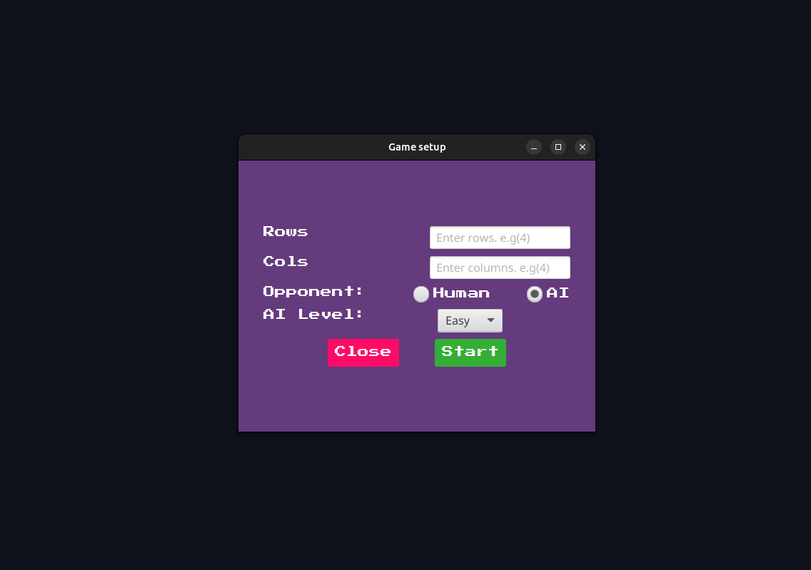
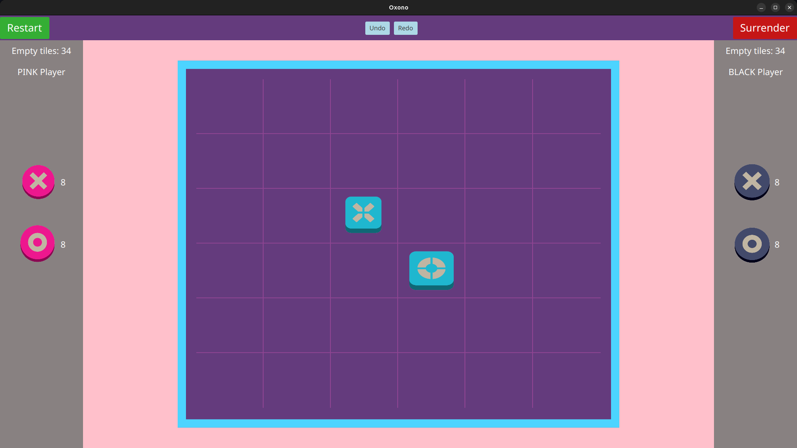
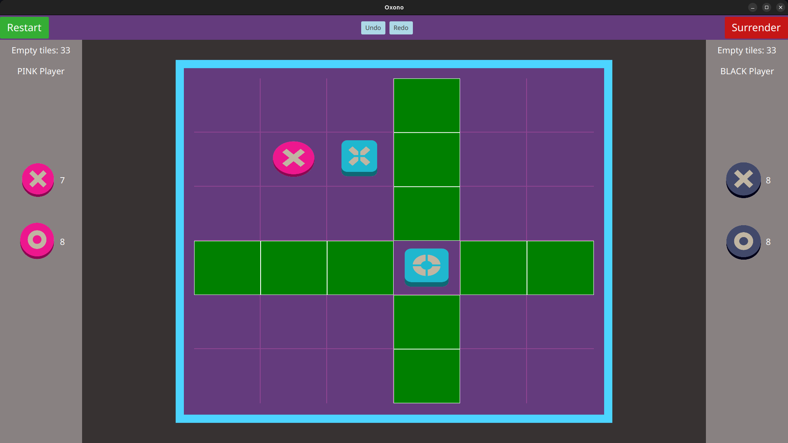

---

  

---

# Oxono Board Game
Educational board game project in **Java (JavaFX)**.  
Developed to practice **software architecture (MVC)**,**design patterns (Command, Observer)**,  
and **clean object-oriented programming**.

---

## Some screenshots from the game play

### Game Setup

### Pink Player Turn

### Black Player Turn

## Features
- Turn-based **board game logic**
- **MVC architecture**
- **Undo/Redo** functionality with Command pattern
- **Observer** for UI updates
- Validation of player moves 
- Simple **AI opponent (Level 0)** → plays the opposite turn if no human player is available
